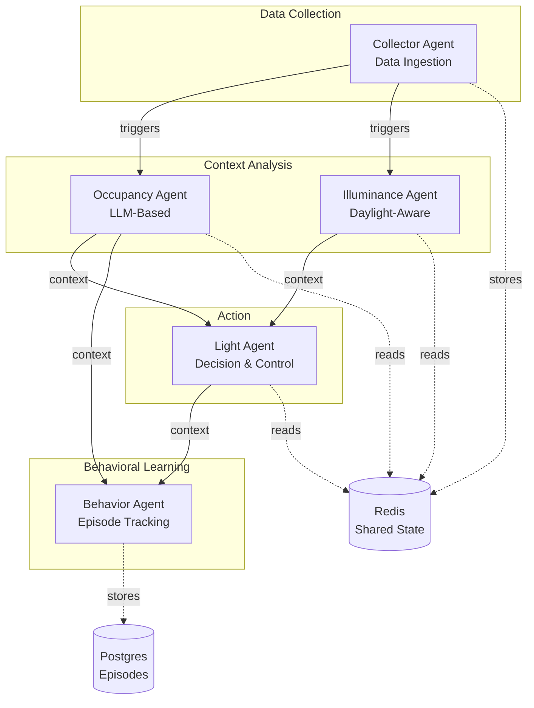
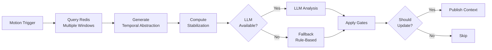

# J.E.E.V.E.S. Agent Catalog

Complete reference for all agents in the J.E.E.V.E.S. platform.

## Table of Contents
- [Agent Overview](#agent-overview)
- [Collector Agent](#collector-agent)
- [Occupancy Agent](#occupancy-agent)
- [Illuminance Agent](#illuminance-agent)
- [Light Agent](#light-agent)
- [Behavior Agent](#behavior-agent)
- [Agent Comparison](#agent-comparison)

---

## Agent Overview

Each agent in J.E.E.V.E.S. is a specialized service that:
1. Subscribes to specific MQTT topics
2. Processes data (trigger-based or periodic)
3. Publishes results to MQTT
4. Uses Redis for shared state



---

## Collector Agent

**Status**: ✅ Fully Implemented
**Purpose**: Data ingestion layer - receives raw sensor data, stores in Redis, publishes triggers
**Code Location**: [`internal/collector/`](../internal/collector/)
**Lines of Code**: ~400 LOC

### Responsibilities

1. **Subscribe** to all raw sensor topics (`automation/raw/+/+`)
2. **Parse** and validate sensor messages
3. **Store** data in Redis using appropriate data structures
4. **Publish** trigger messages for downstream agents
5. **Cleanup** old data automatically (24-hour TTL)

### Key Types

```go
// SensorMessage - parsed sensor data
type SensorMessage struct {
    SensorType    string
    Location      string
    OriginalTopic string
    Data          map[string]interface{}
    Timestamp     time.Time
    CollectedAt   int64 // Unix milliseconds
}

// Agent orchestrates collection
type Agent struct {
    mqtt      mqtt.Client
    redis     redis.Client
    processor *Processor    // Message parsing
    storage   *Storage       // Redis operations
    cfg       *config.Config
    logger    *slog.Logger
}
```

### MQTT Topics

| Direction | Topic Pattern | Purpose | Example |
|-----------|---------------|---------|---------|
| **Subscribe** | `automation/raw/{type}/{location}` | Raw sensor data | `automation/raw/motion/study` |
| **Publish** | `automation/sensor/{type}/{location}` | Processed trigger | `automation/sensor/motion/study` |

### Redis Schema

#### Motion Sensors
```
Key: sensor:motion:{location}          (Sorted Set)
  - Score: Unix timestamp (ms)
  - Value: JSON with {state, entity_id, sequence, collected_at}
  - TTL: 24 hours

Key: meta:motion:{location}            (Hash)
  - Field: lastMotionTime → timestamp (ms)
  - Updated only when state == "on"
  - TTL: 24 hours
```

#### Environmental Sensors (temp/illuminance)
```
Key: sensor:environmental:{location}   (Sorted Set)
  - Score: Unix timestamp (ms)
  - Value: JSON with {temperature, illuminance, units, ...}
  - Consolidated storage for all environmental data
  - TTL: 24 hours
```

#### Generic Sensors
```
Key: sensor:{type}:{location}          (List)
  - LPUSH newest entries
  - LTRIM to max 1000 entries
  - TTL: 24 hours

Key: meta:{type}:{location}            (Hash)
  - Fields: last_update, sensor_type, location
  - TTL: 24 hours
```

### Storage Decision Logic

```go
switch msg.SensorType {
case "motion":
    // Use sorted set + metadata hash
    return s.storeMotionData(ctx, msg, processor)

case "temperature", "illuminance":
    // Use consolidated sorted set
    return s.storeEnvironmentalData(ctx, msg, processor)

default:
    // Generic fallback (list + metadata)
    return s.storeGenericData(ctx, msg, processor)
}
```

### Dependencies

- **MQTT**: Eclipse Paho (`pkg/mqtt`)
- **Redis**: go-redis (`pkg/redis`)
- **Config**: Shared config (`pkg/config`)

### Configuration

```bash
# Environment variables
JEEVES_MQTT_BROKER=mqtt.service.consul
JEEVES_MQTT_PORT=1883
JEEVES_REDIS_HOST=redis.service.consul
JEEVES_REDIS_PORT=6379
JEEVES_MAX_SENSOR_HISTORY=1000  # For generic sensors
```

### Example Flow

```
1. PIR sensor publishes: automation/raw/motion/study
   Payload: {"data": {"state": "on", "entity_id": "motion.study"}}

2. Collector receives and parses message
   - Extracts: sensorType=motion, location=study
   - Validates payload structure

3. Collector stores to Redis:
   - ZADD sensor:motion:study {timestamp} {json_data}
   - HSET meta:motion:study lastMotionTime {timestamp}
   - EXPIRE both keys 86400 (24 hours)
   - ZREMRANGEBYSCORE (cleanup old entries)

4. Collector publishes trigger:
   - Topic: automation/sensor/motion/study
   - Payload: {"data": {...}, "original_topic": ..., "stored_at": ...}
   - QoS: 0, Not retained
```

### Performance

- **Latency**: < 10ms per message
- **Throughput**: Handles 100+ msg/sec (way over home needs of ~2 msg/sec)
- **Memory**: ~128 MB
- **CPU**: ~100 MHz

---

## Occupancy Agent

**Status**: ✅ Fully Implemented
**Purpose**: Detect room occupancy using LLM-based temporal analysis
**Code Location**: [`internal/occupancy/`](../internal/occupancy/)
**Lines of Code**: ~3,300 LOC (largest agent - includes LLM integration)

### Responsibilities

1. **Detect** occupancy state changes (occupied ↔ empty)
2. **Analyze** motion patterns using LLM reasoning
3. **Abstract** temporal data for better LLM performance
4. **Stabilize** predictions using Vonich-Hakim algorithm
5. **Publish** occupancy context with confidence and reasoning

### Key Types

```go
// Agent orchestrates occupancy detection
type Agent struct {
    mqtt    mqtt.Client
    redis   redis.Client
    storage *Storage
    cfg     *config.Config
    logger  *slog.Logger
}

// TemporalAbstraction - semantic representation of motion data
type TemporalAbstraction struct {
    CurrentState struct {
        MinutesSinceLastMotion float64
    }
    MotionDensity struct {
        Last2Min  int  // Active presence
        Last8Min  int  // Recent activity
        Last20Min int  // Pattern detection
        Last60Min int  // Context
    }
    TemporalPatterns struct {
        Last2Min  string  // "frequent", "sparse", "none"
        Last8Min  string
        Last20Min string
        Last60Min string
    }
    EnvironmentalSignals struct {
        TimeOfDay string  // "morning", "midday", etc.
    }
}

// AnalysisResult - LLM or fallback output
type AnalysisResult struct {
    Occupied   bool
    Confidence float64
    Reasoning  string
}

// StabilizationResult - Vonich-Hakim dampening
type StabilizationResult struct {
    RecentVariance  float64
    HasOscillation  bool
    ShouldDampen    bool
    Recommendation  string
}
```

### MQTT Topics

| Direction | Topic Pattern | Purpose | Example |
|-----------|---------------|---------|---------|
| **Subscribe** | `automation/sensor/motion/+` | Motion triggers | `automation/sensor/motion/study` |
| **Publish** | `automation/context/occupancy/{location}` | Occupancy state | `automation/context/occupancy/study` |

**Note**: This is a **trigger-based architecture**. The MQTT message payload is ignored - the trigger signals "new motion data available in Redis for this location."

### Redis Schema

#### Reads Motion History
```
Key: sensor:motion:{location}          (Sorted Set - written by collector)
  - Queries multiple time windows:
    - Last 2 minutes: Active presence check
    - Last 8 minutes: Pattern detection (settling in vs. pass-through)
    - Last 20 minutes: Behavior context
    - Last 60 minutes: Full session context
```

#### Stores Temporal State
```
Key: occupancy:state:{location}        (Hash)
  - current_occupancy: true/false
  - last_state_change: timestamp
  - last_analysis: timestamp
```

#### Stores Prediction History
```
Key: occupancy:predictions:{location}  (List)
  - Last 10 predictions: [{occupied, confidence, timestamp}]
  - Used for Vonich-Hakim stabilization
  - Detects oscillation patterns
```

### Analysis Pipeline



### Analysis Methods

#### 1. Initial Motion Detection (Fast Path)
- **Trigger**: First motion in unknown location
- **Logic**: If motion in last 2 minutes AND no previous state → set occupied
- **Confidence**: 0.9 (high)
- **Latency**: < 10ms (no LLM)
- **Purpose**: Immediate response to room entry

#### 2. LLM-Based Analysis
- **Trigger**: Subsequent motion or periodic check
- **Input**: Temporal abstraction (semantic patterns)
- **Model**: Default `mixtral:8x7b` (configurable)
- **Prompt**: Structured with 4 pattern categories
- **Output**: `{occupied, confidence, reasoning}`
- **Latency**: 1-5 seconds

#### 3. Deterministic Fallback
- **Trigger**: LLM unavailable/timeout
- **Logic**: Rule-based decision tree matching LLM prompt
- **Patterns**:
  - **Pattern 1**: Active presence (motion in last 2 min) → occupied
  - **Pattern 2**: Recent motion (< 5 min) + multiple events → settling in → occupied
  - **Pattern 3**: Single motion 5-10 min ago → pass-through → empty
  - **Pattern 4**: Extended absence (> 10 min) → empty
- **Latency**: < 1ms

### Vonich-Hakim Stabilization

Prevents rapid state oscillation when LLM is uncertain.

```go
// Analyzes last 10 predictions
func VonichHakimStabilization(predictions []Prediction) StabilizationResult {
    // 1. Calculate confidence variance
    variance := computeVariance(confidences)

    // 2. Detect oscillation (alternating states)
    hasOscillation := detectOscillation(predictions)

    // 3. Determine dampening need
    shouldDampen := variance > 0.15 || hasOscillation

    // 4. Recommend increased confidence threshold
    if shouldDampen {
        return StabilizationResult{
            ShouldDampen: true,
            Recommendation: "High variance detected, increase confidence threshold"
        }
    }

    return StabilizationResult{ShouldDampen: false}
}
```

### Confidence & Timing Gates

Prevents low-confidence updates and rapid toggling.

```go
func ShouldUpdateOccupancy(
    currentOccupancy *bool,
    lastStateChange *time.Time,
    result AnalysisResult,
    stabilization StabilizationResult,
) bool {
    // Gate 1: Confidence threshold
    requiredConfidence := 0.6  // Base for state changes
    if !stateChanging {
        requiredConfidence = 0.3  // Lower for maintaining state
    }
    if stabilization.ShouldDampen {
        requiredConfidence += 0.3  // Increase when unstable
    }

    if result.Confidence < requiredConfidence {
        return false  // Too uncertain
    }

    // Gate 2: Time hysteresis (only for state changes)
    if stateChanging && timeSinceLastChange < 45*time.Second {
        return false  // Too soon
    }

    return true
}
```

### Dependencies

- **MQTT**: Eclipse Paho
- **Redis**: go-redis
- **LLM**: HTTP client to Ollama (or compatible API)
- **Config**: Shared config

### Configuration

```bash
# Environment variables
JEEVES_OCCUPANCY_ANALYSIS_INTERVAL_SEC=60  # Periodic check interval
JEEVES_LLM_ENDPOINT=http://localhost:11434/api/generate
JEEVES_LLM_MODEL=mixtral:8x7b
JEEVES_MAX_EVENT_HISTORY=100
```

### Example Flow

```
1. Motion trigger received: automation/sensor/motion/study
   (Payload ignored - just a trigger)

2. Agent queries Redis for motion history:
   - ZRANGEBYSCORE sensor:motion:study (now - 2min) (now)
   - ZRANGEBYSCORE sensor:motion:study (now - 8min) (now)
   - ZRANGEBYSCORE sensor:motion:study (now - 20min) (now)
   - ZRANGEBYSCORE sensor:motion:study (now - 60min) (now)

3. Generate temporal abstraction:
   - Minutes since last motion: 0.5
   - Motion counts: {2min: 1, 8min: 3, 20min: 5, 60min: 8}
   - Patterns: {2min: "sparse", 8min: "frequent", ...}

4. Compute stabilization:
   - Query prediction history
   - Calculate variance: 0.08 (low)
   - Detect oscillation: false
   - Result: No dampening needed

5. Run LLM analysis:
   - Send abstraction to LLM
   - Receive: {occupied: true, confidence: 0.75, reasoning: "Multiple motions..."}

6. Apply gates:
   - Confidence check: 0.75 > 0.6 ✓
   - Time hysteresis: 60s since last change ✓
   - Decision: PUBLISH

7. Publish context:
   - Topic: automation/context/occupancy/study
   - Payload: {
       location: "study",
       occupied: true,
       confidence: 0.75,
       reasoning: "Multiple motions detected, person settling in",
       timestamp: "2024-01-01T12:00:00Z"
     }
```

### Performance

- **Latency**: 1-5s (LLM) or < 1ms (fallback)
- **Memory**: ~128 MB
- **CPU**: ~100 MHz (+ LLM on separate host)
- **LLM Calls**: Reduced via periodic analysis (not per-event)

---

## Illuminance Agent

**Status**: ✅ Fully Implemented
**Purpose**: Track ambient light levels and provide daylight-aware context
**Code Location**: [`internal/illuminance/`](../internal/illuminance/)
**Lines of Code**: ~800 LOC

### Responsibilities

1. **Analyze** illuminance readings from sensors
2. **Calculate** theoretical daylight levels (astronomical algorithms)
3. **Abstract** light levels into semantic labels
4. **Detect** trends and stability
5. **Publish** illuminance context for downstream agents

### Key Types

```go
// Agent orchestrates illuminance analysis
type Agent struct {
    mqtt    mqtt.Client
    redis   redis.Client
    storage *Storage
    cfg     *config.Config
    logger  *slog.Logger
    states  map[string]*LocationState  // Track analysis state
}

// IlluminanceAbstraction - semantic representation
type IlluminanceAbstraction struct {
    Current struct {
        Lux   float64
        Label string  // "dark", "dim", "bright", "very_bright"
    }
    Statistics struct {
        Avg2Min  float64
        Avg10Min float64
        Min10Min float64
        Max10Min float64
    }
    TemporalAnalysis struct {
        Trend10Min string  // "increasing", "decreasing", "stable"
        Stability  string  // "stable", "fluctuating", "highly_variable"
    }
    Daylight struct {
        IsDaytime             bool
        TheoreticalOutdoorLux float64
        SolarElevation        float64
    }
    Context struct {
        TimeOfDay          string    // "morning", "midday", "evening", "night"
        RelativeToTypical  string    // "darker_than_usual", "typical", "brighter_than_usual"
        LikelySources      []string  // ["natural", "artificial"]
    }
    DataSource string  // "sensor_data" or "daylight_calculation"
}
```

### MQTT Topics

| Direction | Topic Pattern | Purpose | Example |
|-----------|---------------|---------|---------|
| **Subscribe** | `automation/sensor/illuminance/+` | Illuminance triggers | `automation/sensor/illuminance/study` |
| **Publish** | `automation/context/illuminance/{location}` | Light level context | `automation/context/illuminance/study` |

### Redis Schema

#### Reads Illuminance History
```
Key: sensor:environmental:{location}   (Sorted Set - written by collector)
  - Queries time windows:
    - Last 2 minutes: Current average
    - Last 10 minutes: Trend detection, min/max, stability
    - Last 60 minutes: Behavior patterns
```

### Analysis Windows

```go
type TimeWindow struct {
    Name      string
    Duration  time.Duration
    Purpose   string
}

var windows = []TimeWindow{
    {Name: "2min",  Duration: 2*time.Minute,  Purpose: "Current average"},
    {Name: "10min", Duration: 10*time.Minute, Purpose: "Trend & stability"},
    {Name: "60min", Duration: 60*time.Minute, Purpose: "Full context"},
}
```

### Daylight Calculation

Uses astronomical algorithms to calculate theoretical outdoor illuminance:

```go
func CalculateTheoreticalIlluminance(lat, lon float64, t time.Time) float64 {
    // 1. Calculate solar position
    solarElevation := calculateSolarElevation(lat, lon, t)

    // 2. Estimate atmospheric attenuation
    if solarElevation <= 0 {
        return 0  // Nighttime
    }

    // 3. Clear sky illuminance model
    maxIlluminance := 120000.0  // lux at solar noon
    illuminance := maxIlluminance * sin(solarElevation)

    return illuminance
}
```

**Purpose**: Fallback when insufficient sensor data. Helps detect artificial lighting vs. natural.

### Label Classification

```go
func ClassifyIlluminance(lux float64) string {
    switch {
    case lux < 10:
        return "dark"        // < 10 lux: Dark room
    case lux < 100:
        return "dim"         // 10-100 lux: Dim lighting
    case lux < 500:
        return "bright"      // 100-500 lux: Normal indoor
    case lux >= 500:
        return "very_bright" // > 500 lux: Bright/daylight
    default:
        return "unknown"
    }
}
```

### Publishing Logic

Publishes when:
1. **State changed** (label changed: dark → dim)
2. **Periodic update** (> 5 minutes since last)
3. **Sensor trigger** (new reading arrived)
4. **First analysis** (initial state for location)

Avoids spam by throttling redundant updates.

### Dependencies

- **MQTT**: Eclipse Paho
- **Redis**: go-redis
- **Astronomy**: Custom solar position algorithms
- **Config**: Shared config

### Configuration

```bash
# Environment variables
JEEVES_LATITUDE=60.1695              # Helsinki
JEEVES_LONGITUDE=24.9354
JEEVES_ANALYSIS_INTERVAL_SEC=30      # Periodic check
JEEVES_MAX_DATA_AGE_HOURS=1.0        # Sufficient data threshold
JEEVES_MIN_READINGS_REQUIRED=3       # Minimum for sensor-based analysis
```

### Example Flow

```
1. Illuminance trigger: automation/sensor/illuminance/study

2. Query Redis for readings:
   - Last 2 min: [450, 455, 460] lux
   - Last 10 min: [400, 420, 440, 450, 455, 460] lux

3. Calculate statistics:
   - Avg 2min: 455 lux
   - Avg 10min: 438 lux
   - Min 10min: 400 lux
   - Max 10min: 460 lux

4. Determine trend:
   - 10-min trend: "increasing" (400 → 460)
   - Stability: "stable" (range: 60 lux < 100 threshold)

5. Calculate daylight:
   - Time: 14:00 UTC, Date: June 15
   - Solar elevation: 52°
   - Theoretical outdoor: 98,000 lux
   - Is daytime: true

6. Generate context:
   - Label: "bright" (455 lux)
   - Time of day: "midday"
   - Relative to typical: "typical" (indoor expected ~400-500)
   - Likely sources: ["natural", "artificial"] (mixed)

7. Check if should publish:
   - Previous label: "dim"
   - New label: "bright"
   - State changed: YES → PUBLISH

8. Publish context:
   - Topic: automation/context/illuminance/study
   - Payload: {
       location: "study",
       state: "bright",
       data: {
         current_lux: 455,
         trend: "increasing",
         is_daytime: true,
         ...
       },
       timestamp: "2024-06-15T14:00:00Z"
     }
```

### Performance

- **Latency**: < 50ms
- **Memory**: ~128 MB
- **CPU**: ~50 MHz

---

## Light Agent

**Status**: ✅ Fully Implemented
**Purpose**: Make lighting decisions and control physical lights
**Code Location**: [`internal/light/`](../internal/light/)
**Lines of Code**: ~1,200 LOC

### Responsibilities

1. **Subscribe** to occupancy and illuminance context
2. **Decide** if lights should be on/off/adjusted
3. **Calculate** appropriate brightness and color temperature
4. **Rate limit** decisions to prevent flicker
5. **Handle** manual overrides (user controls)
6. **Publish** lighting commands and context

### Key Types

```go
// Agent orchestrates lighting decisions
type Agent struct {
    mqtt            mqtt.Client
    redis           redis.Client
    analyzer        *IlluminanceAnalyzer
    overrideManager *OverrideManager
    rateLimiter     *RateLimiter
    locationContexts map[string]*LocationContext
    cfg             *config.Config
    logger          *slog.Logger
}

// LocationContext tracks state
type LocationContext struct {
    OccupancyState      string
    OccupancyConfidence float64
    LastUpdate          time.Time
}

// Decision output
type Decision struct {
    Action     string   // "on", "off", "maintain"
    Brightness int      // 0-100
    ColorTemp  int      // Kelvin (0 = no change)
    Reason     string
    Confidence float64
}

// IlluminanceAnalyzer reads sensor data
type IlluminanceAnalyzer struct {
    redis  redis.Client
    cfg    *config.Config
    logger *slog.Logger
}

// OverrideManager tracks manual interventions
type OverrideManager struct {
    mutex     sync.RWMutex
    overrides map[string]*Override
}

// RateLimiter prevents rapid commands
type RateLimiter struct {
    mutex         sync.RWMutex
    lastDecisions map[string]time.Time
}
```

### MQTT Topics

| Direction | Topic Pattern | Purpose | Example |
|-----------|---------------|---------|---------|
| **Subscribe** | `automation/context/occupancy/+` | Room occupancy | `automation/context/occupancy/study` |
| **Subscribe** | `automation/context/illuminance/+` | Light levels | `automation/context/illuminance/study` |
| **Publish** | `automation/command/light/{location}` | Light commands | `automation/command/light/study` |
| **Publish** | `automation/context/lighting/{location}` | Lighting state | `automation/context/lighting/study` |

### Redis Schema

#### Reads Illuminance History
```
Key: sensor:environmental:{location}
  - Queries recent readings to determine if lights needed
```

#### Stores Manual Overrides
```
Key: light:override:{location}        (Hash)
  - enabled: true/false
  - expires_at: timestamp
  - reason: "manual_control"
```

### Decision Logic

```go
func MakeLightingDecision(
    ctx context.Context,
    location string,
    occupancyState string,
    occupancyConfidence float64,
    analyzer *IlluminanceAnalyzer,
    overrideManager *OverrideManager,
    logger *slog.Logger,
) *Decision {
    // 1. Check manual override
    if overrideManager.IsOverridden(location) {
        return &Decision{
            Action: "maintain",
            Reason: "Manual override active",
        }
    }

    // 2. Room empty? Turn off lights
    if occupancyState == "empty" {
        return &Decision{
            Action:     "off",
            Brightness: 0,
            Reason:     "Room empty",
            Confidence: occupancyConfidence,
        }
    }

    // 3. Room occupied - check if lights needed
    needsLight, currentLux := analyzer.NeedsAdditionalLight(ctx, location)

    if !needsLight {
        return &Decision{
            Action: "maintain",
            Reason: fmt.Sprintf("Sufficient light (%.0f lux)", currentLux),
        }
    }

    // 4. Calculate brightness
    brightness := CalculateBrightness(currentLux)

    // 5. Calculate color temperature (time-based)
    colorTemp := CalculateColorTemperature(time.Now())

    return &Decision{
        Action:     "on",
        Brightness: brightness,
        ColorTemp:  colorTemp,
        Reason:     fmt.Sprintf("Occupied, insufficient light (%.0f lux)", currentLux),
        Confidence: occupancyConfidence,
    }
}
```

### Brightness Calculation

```go
func CalculateBrightness(currentLux float64) int {
    // Target: 300-500 lux for comfortable indoor lighting
    const targetLux = 400.0

    if currentLux >= targetLux {
        return 0  // No additional light needed
    }

    // Calculate deficit
    deficit := targetLux - currentLux

    // Map to brightness (0-100)
    brightness := int((deficit / targetLux) * 100)

    // Clamp
    if brightness < 20 {
        return 20  // Minimum useful brightness
    }
    if brightness > 100 {
        return 100
    }

    return brightness
}
```

### Color Temperature (Circadian)

```go
func CalculateColorTemperature(t time.Time) int {
    hour := t.Hour()

    switch {
    case hour >= 6 && hour < 10:
        return 4500  // Cool white (morning - wake up)
    case hour >= 10 && hour < 18:
        return 5000  // Daylight (daytime - alertness)
    case hour >= 18 && hour < 21:
        return 3500  // Warm white (evening - relaxation)
    case hour >= 21 || hour < 6:
        return 2700  // Warm (night - melatonin friendly)
    default:
        return 4000  // Neutral default
    }
}
```

### Rate Limiting

Prevents light flicker from rapid occupancy changes:

```go
func (r *RateLimiter) ShouldMakeDecision(location string, minIntervalMs int) bool {
    r.mutex.RLock()
    lastTime, exists := r.lastDecisions[location]
    r.mutex.RUnlock()

    if !exists {
        return true  // First decision
    }

    elapsed := time.Since(lastTime)
    minInterval := time.Duration(minIntervalMs) * time.Millisecond

    return elapsed >= minInterval
}
```

**Default**: Minimum 10 seconds between decisions per location.

### Manual Override

Detects manual control (user turned off lights) and respects it:

```go
func (o *OverrideManager) SetOverride(location string, durationMinutes int) {
    o.mutex.Lock()
    defer o.mutex.Unlock()

    o.overrides[location] = &Override{
        Enabled:   true,
        ExpiresAt: time.Now().Add(time.Duration(durationMinutes) * time.Minute),
        Reason:    "manual_control",
    }
}
```

**Default**: 30-minute override duration.

### Triggers

1. **Occupancy State Change**: Immediate decision (bypasses rate limit)
2. **Periodic Check**: Every 30s (default), respects rate limit
3. **Illuminance Update**: Logged but doesn't trigger decision (avoids spam)

### Dependencies

- **MQTT**: Eclipse Paho
- **Redis**: go-redis
- **Config**: Shared config

### Configuration

```bash
# Environment variables
JEEVES_DECISION_INTERVAL_SEC=30        # Periodic check
JEEVES_MANUAL_OVERRIDE_MINUTES=30      # Override duration
JEEVES_MIN_DECISION_INTERVAL_MS=10000  # Rate limit (10s)
JEEVES_API_PORT=3002                   # HTTP API for manual control
```

### Example Flow

```
1. Occupancy change: automation/context/occupancy/study
   Payload: {location: "study", occupied: true, confidence: 0.8}

2. Agent detects state change:
   - Previous: empty
   - New: occupied
   - Trigger immediate decision (bypass rate limit)

3. Check manual override:
   - Query override manager
   - Result: Not overridden

4. Query illuminance:
   - ZRANGEBYSCORE sensor:environmental:study (last 2min)
   - Result: [120, 125, 118] lux
   - Average: 121 lux

5. Decision logic:
   - Room occupied? YES
   - Needs light? YES (121 < 400 target)
   - Calculate brightness: 70% (279 lux deficit)
   - Calculate color temp: 5000K (midday)

6. Publish command:
   - Topic: automation/command/light/study
   - Payload: {
       action: "on",
       brightness: 70,
       color_temp: 5000,
       reason: "Occupied, insufficient light (121 lux)",
       confidence: 0.8
     }

7. Publish context:
   - Topic: automation/context/lighting/study
   - Payload: {
       source: "light-agent",
       location: "study",
       state: "on",
       brightness: 70,
       illuminating: true,
       automated: true
     }

8. Record decision time (for rate limiting)
```

### Performance

- **Latency**: < 100ms (decision + publish)
- **Memory**: ~128 MB
- **CPU**: ~100 MHz

---

## Behavior Agent

**Status**: 🚧 Initial Implementation (Stub)
**Purpose**: Track behavioral episodes - periods of activity in specific locations - for future pattern learning
**Code Location**: [`internal/behavior/`](../internal/behavior/)
**Lines of Code**: ~210 LOC

### Responsibilities

1. **Monitor** context events (occupancy, lighting, media)
2. **Detect** episode boundaries (start/end of activities)
3. **Create** semantic episode records using JSON-LD ontology
4. **Store** episodes in Postgres with timestamps and metadata
5. **Publish** episode lifecycle events (started, closed)

### Key Types

```go
// Agent tracks behavioral episodes
type Agent struct {
    mqtt   mqtt.Client
    redis  redis.Client
    db     *sql.DB
    cfg    *config.Config
    logger *slog.Logger

    activeEpisodes     map[string]string // location → episode ID
    lastOccupancyState map[string]string // location → "occupied" | "empty"
    stateMux           sync.RWMutex
}

// BehavioralEpisode is stored as JSON-LD in Postgres
type BehavioralEpisode struct {
    Context    map[string]interface{} `json:"@context"`
    Type       string                 `json:"@type"`
    ID         string                 `json:"@id"`
    StartedAt  time.Time              `json:"jeeves:startedAt"`
    EndedAt    *time.Time             `json:"jeeves:endedAt,omitempty"`
    DayOfWeek  string                 `json:"jeeves:dayOfWeek"`
    TimeOfDay  string                 `json:"jeeves:timeOfDay"`
    Duration   string                 `json:"jeeves:duration,omitempty"`
    Activity   Activity               `json:"adl:activity"`
    EnvContext EnvironmentalContext   `json:"jeeves:hadEnvironmentalContext"`
}
```

### MQTT Topics

| Direction | Topic Pattern | Purpose | Example |
|-----------|---------------|---------|---------|
| **Subscribe** | `automation/context/occupancy/+` | Occupancy state changes | `automation/context/occupancy/living_room` |
| **Subscribe** | `automation/context/lighting/+` | Lighting state changes | `automation/context/lighting/living_room` |
| **Subscribe** | `automation/media/+/+` | Media playback events | `automation/media/playing/living_room` |
| **Publish** | `automation/behavior/episode/started` | Episode started | Episode beginning detected |
| **Publish** | `automation/behavior/episode/closed` | Episode ended | Episode closed with reason |

### Postgres Schema

#### behavioral_episodes Table

```sql
CREATE TABLE behavioral_episodes (
    id SERIAL PRIMARY KEY,
    jsonld JSONB NOT NULL,
    location TEXT GENERATED ALWAYS AS (jsonld->'adl:activity'->'adl:location'->>'name') STORED,
    created_at TIMESTAMP DEFAULT NOW()
);

CREATE INDEX idx_episodes_location ON behavioral_episodes(location);
CREATE INDEX idx_episodes_jsonld ON behavioral_episodes USING gin(jsonld);
```

**Key Fields in JSONLD**:
- `@context`: JSON-LD context with ontology namespaces (SAREF, ADL, SOSA)
- `jeeves:startedAt`: Episode start timestamp (RFC3339)
- `jeeves:endedAt`: Episode end timestamp (RFC3339, nullable)
- `jeeves:dayOfWeek`: Day of week (Monday, Tuesday, etc.)
- `jeeves:timeOfDay`: Time segment (morning, afternoon, evening, night)
- `adl:activity`: Activity description with location
- `jeeves:hadEnvironmentalContext`: Environmental sensors/state during episode

### Episode Lifecycle

**Episode Start Triggers**:
- Occupancy transitions from `empty` → `occupied`

**Episode End Triggers**:
- Occupancy transitions from `occupied` → `empty` (reason: `occupancy_empty`)

**Current State Machine** (Stub):
```
[No Episode] --occupied--> [Active Episode] --empty--> [Closed Episode]
```

**Future Enhancements** (Not Yet Implemented):
- Track lighting adjustments during episodes
- Track media activity during episodes
- Infer activity types from patterns (watching TV, working, sleeping)
- Use episode history to predict preferences

### Example Message Flow

```
1. Occupancy detected:
   Topic: automation/context/occupancy/living_room
   Payload: {
     "location": "living_room",
     "state": "occupied",
     "confidence": 0.85
   }

2. Agent starts episode:
   - Creates BehavioralEpisode with UUID
   - Stores in Postgres: INSERT INTO behavioral_episodes (jsonld) VALUES (...)
   - Publishes started event

3. Published event:
   Topic: automation/behavior/episode/started
   Payload: {
     "location": "living_room",
     "trigger_type": "occupancy_transition"
   }

4. [Time passes, media starts, lights adjusted...]

5. Occupancy cleared:
   Topic: automation/context/occupancy/living_room
   Payload: {
     "location": "living_room",
     "state": "empty",
     "confidence": 0.9
   }

6. Agent ends episode:
   - Updates episode: UPDATE behavioral_episodes SET jsonld = jsonb_set(...)
   - Publishes closed event

7. Published event:
   Topic: automation/behavior/episode/closed
   Payload: {
     "location": "living_room",
     "end_reason": "occupancy_empty"
   }
```

### Ontology Standards

The Behavior Agent uses semantic web standards for interoperability:

- **SAREF** (Smart Applications REFerence): Base ontology for IoT devices
- **SSN/SOSA**: Semantic Sensor Network ontology
- **ADL**: Activities of Daily Living ontology
- **PROV**: Provenance tracking
- **Custom**: `jeeves:` namespace for platform-specific concepts

**JSON-LD Context**:
```json
{
  "@vocab": "https://saref.etsi.org/core#",
  "jeeves": "https://jeeves.home/vocab#",
  "adl": "http://purl.org/adl#",
  "sosa": "http://www.w3.org/ns/sosa/",
  "prov": "http://www.w3.org/ns/prov#",
  "xsd": "http://www.w3.org/2001/XMLSchema#"
}
```

### Dependencies

- **MQTT**: Eclipse Paho
- **Redis**: go-redis (for shared state, minimal usage)
- **Postgres**: lib/pq driver
- **Config**: Shared config
- **Ontology**: pkg/ontology (JSON-LD types)

### Configuration

```bash
# Environment variables
JEEVES_POSTGRES_HOST=localhost
JEEVES_POSTGRES_PORT=5432
JEEVES_POSTGRES_DB=jeeves_behavior
JEEVES_POSTGRES_USER=jeeves
JEEVES_POSTGRES_PASSWORD=secret
```

### Example Flow

```
1. Occupancy transition received: automation/context/occupancy/living_room
   Payload: {"location": "living_room", "state": "occupied", "confidence": 0.85}

2. Agent checks previous state:
   - Previous: "empty"
   - Current: "occupied"
   - Trigger: START EPISODE

3. Create episode:
   - Generate UUID: urn:uuid:550e8400-e29b-41d4-a716-446655440000
   - Build JSON-LD document with ontology
   - Insert into Postgres

4. Store episode ID:
   - activeEpisodes["living_room"] = "550e8400-..."

5. Publish started event:
   - Topic: automation/behavior/episode/started
   - Payload: {"location": "living_room", "trigger_type": "occupancy_transition"}

6. [Activity continues, episode remains active]

7. Occupancy transition: "occupied" → "empty"

8. Close episode:
   - Retrieve episode ID from activeEpisodes
   - Update Postgres: SET jsonld = jsonb_set(jsonld, '{jeeves:endedAt}', ...)
   - Remove from activeEpisodes
   - Publish closed event
```

### Performance

- **Latency**: < 50ms (database write + publish)
- **Memory**: ~128 MB
- **CPU**: ~50 MHz
- **Database**: 1 write per episode start/end

### Current Limitations

This is a **stub implementation** for E2E testing infrastructure. Currently implemented:
- ✅ Episode start/end based on occupancy
- ✅ Postgres storage with JSON-LD
- ✅ Episode lifecycle events published
- ✅ Basic ontology structure

**Not yet implemented**:
- ❌ Lighting event tracking (handler is stub)
- ❌ Media event tracking (handler is stub)
- ❌ Activity inference from patterns
- ❌ Episode querying and analysis
- ❌ Integration with learning/prediction systems

---

## Agent Comparison

| Aspect | Collector | Occupancy | Illuminance | Light | Behavior |
|--------|-----------|-----------|-------------|-------|----------|
| **Complexity** | Low | High | Medium | Medium | Low (Stub) |
| **LOC** | ~400 | ~3,300 | ~800 | ~1,200 | ~210 |
| **Latency** | < 10ms | 1-5s (LLM) | < 50ms | < 100ms | < 50ms |
| **CPU** | ~50 MHz | ~100 MHz | ~50 MHz | ~100 MHz | ~50 MHz |
| **Memory** | ~128 MB | ~128 MB | ~128 MB | ~128 MB | ~128 MB |
| **External Deps** | None | LLM (Ollama) | None | None | Postgres |
| **Trigger Mode** | Event (MQTT) | Trigger + Periodic | Trigger + Periodic | Event + Periodic | Event (MQTT) |
| **State Storage** | None | Redis (history, state, predictions) | Redis (history) | Redis (overrides) | Postgres (episodes) |
| **Publish Rate** | Every event | On state change | On label change | On decision | On episode boundary |
| **Critical Path** | Yes | Yes | No | Yes | No |

### Complexity Drivers

- **Collector**: Simple parsing and storage routing
- **Occupancy**: LLM integration, stabilization, gates, multiple analysis modes
- **Illuminance**: Astronomical calculations, trend detection, daylight fallback
- **Light**: Decision logic, rate limiting, overrides, color temperature
- **Behavior**: JSON-LD ontology, episode lifecycle, Postgres integration (stub for now)

### Failure Modes

| Agent | Failure | Impact | Mitigation |
|-------|---------|--------|------------|
| **Collector** | Crashes | No new data ingested | **Critical** - Agents continue using stale Redis data |
| **Occupancy** | Crashes | No occupancy updates | **High** - Lights may stay on/off incorrectly |
| **Occupancy** | LLM unavailable | Uses fallback | **Low** - Deterministic fallback logic |
| **Illuminance** | Crashes | No illuminance context | **Medium** - Light agent uses last known state |
| **Light** | Crashes | No lighting commands | **High** - Manual control still works |
| **Behavior** | Crashes | Episodes not recorded | **Low** - No impact on real-time automation |
| **Behavior** | Postgres down | Episodes not stored | **Low** - Agent continues, logs errors |

**Restart Strategy**: All agents auto-restart via Nomad. No data loss (state in Redis).

---

## Related Documentation

- [ARCHITECTURE.md](./ARCHITECTURE.md) - System overview
- [SHARED_SERVICES.md](./SHARED_SERVICES.md) - pkg/ infrastructure
- [TESTING.md](./TESTING.md) - E2E testing
- [AGENT_DEVELOPMENT.md](./AGENT_DEVELOPMENT.md) - Building new agents

For agent-specific details, see `docs/{agent}/` subdirectories.
