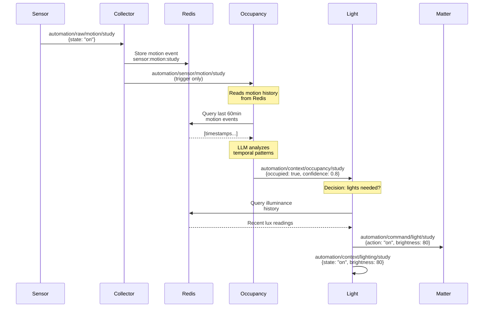
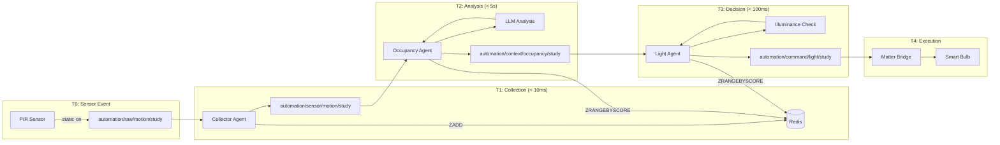

# J.E.E.V.E.S. Platform Architecture

**Just Excellently Executing Various Environmental Services**

## Table of Contents
- [High-Level Architecture](#high-level-architecture)
- [Minestrone Soup Architecture](#minestrone-soup-architecture)
- [Agent Communication](#agent-communication)
- [Shared Services](#shared-services)
- [Monorepo Structure](#monorepo-structure)
- [Data Flow](#data-flow)
- [Design Principles](#design-principles)

---

## High-Level Architecture

J.E.E.V.E.S. is a **distributed agent-based system** for home automation. Each agent is a single-purpose service that:

1. **Subscribes** to relevant MQTT topics
2. **Processes** data (from MQTT triggers and/or Redis)
3. **Publishes** results to MQTT for downstream consumers
4. **Stores** state in Redis (not in-memory)

```mermaid
graph TB
    subgraph "Sensor Layer"
        PIR[PIR Sensors]
        TEMP[Temperature]
        ILLUM[Illuminance]
        MEDIA[Media Players]
        RAW[Raw Sensor Data<br/>automation/raw/+/+]
    end

    subgraph "Collection Layer"
        COLL[Collector Agent]
        REDIS[(Redis<br/>Time-Series Storage)]
    end

    subgraph "Context Layer"
        OCC[Occupancy Agent<br/>LLM-Based]
        ILL[Illuminance Agent<br/>Daylight Aware]
    end

    subgraph "Action Layer"
        LIGHT[Light Agent<br/>Matter Bridge]
    end

    subgraph "Learning Layer"
        BEH[Behavior Agent<br/>Episode Tracking]
        POSTGRES[(Postgres<br/>Semantic Episodes)]
    end

    subgraph "Infrastructure"
        MQTT[MQTT Broker<br/>Mosquitto]
    end

    PIR -->|motion events| RAW
    TEMP -->|temp readings| RAW
    ILLUM -->|lux readings| RAW
    MEDIA -->|playback events| MQTT

    RAW -->|automation/raw/{type}/{loc}| COLL
    COLL -->|stores| REDIS
    COLL -->|automation/sensor/{type}/{loc}| OCC
    COLL -->|automation/sensor/{type}/{loc}| ILL

    OCC -->|reads history| REDIS
    ILL -->|reads history| REDIS

    OCC -->|automation/context/occupancy/{loc}| LIGHT
    OCC -->|automation/context/occupancy/{loc}| BEH
    ILL -->|automation/context/illuminance/{loc}| LIGHT

    LIGHT -->|automation/command/light/{loc}| Matter[Matter Devices]
    LIGHT -->|automation/context/lighting/{loc}| MQTT
    LIGHT -->|automation/context/lighting/{loc}| BEH

    MEDIA -->|automation/media/{state}/{loc}| BEH

    BEH -->|stores episodes| POSTGRES

    MQTT -.->|pub/sub| COLL
    MQTT -.->|pub/sub| OCC
    MQTT -.->|pub/sub| ILL
    MQTT -.->|pub/sub| LIGHT
    MQTT -.->|pub/sub| BEH
```

---

## Minestrone Soup Architecture

The **Minestrone Soup Architecture** is our core design philosophy:

> **"Composable primitives that are independently deployable, like ingredients in a soup"**

### Principles:

1. **Single Responsibility**: Each agent does ONE thing well
   - Collector: Ingests and stores sensor data
   - Occupancy: Detects if rooms are occupied
   - Illuminance: Tracks lighting needs
   - Light: Controls physical lights
   - Behavior: Records behavioral episodes for pattern learning

2. **Loose Coupling**: Agents communicate only via MQTT
   - No direct dependencies between agents
   - No shared code between agent implementations
   - Agents can be deployed/updated independently

3. **Event-Driven**: All communication is asynchronous
   - Agents react to MQTT messages (triggers)
   - No request/response patterns
   - No synchronous calls between agents

4. **Stateless Where Possible**: State lives in Redis, not agent memory
   - Agents can crash and restart without data loss
   - Multiple instances can run (future: for load balancing)
   - State is queryable outside the agents

5. **Configuration Hierarchy**: Flexible deployment
   - Defaults → Environment Variables → CLI Flags
   - Same binary runs in dev, staging, production

### Why "Minestrone Soup"?

- **Ingredients** (Agents) have distinct flavors (responsibilities)
- **Broth** (MQTT) carries messages between ingredients
- **Stock** (Redis) provides shared state and history
- **Recipe** (Topology) defines how ingredients combine
- **Bowl** (Monorepo) contains everything in one place

You can **add**, **remove**, or **replace** agents without changing others.

---

## Agent Communication

### MQTT as Message Bus

All agents communicate via **MQTT pub/sub patterns**. No agent knows about other agents directly.

### Topic Hierarchy

```
automation/
├── raw/{sensor_type}/{location}       # Raw sensor data (input)
├── sensor/{sensor_type}/{location}    # Processed triggers (collector output)
├── context/{context_type}/{location}  # Analyzed context (agent insights)
└── command/{device_type}/{location}   # Device commands (action requests)
```

### Topic Examples

| Layer | Topic | Purpose | Publisher | Subscribers |
|-------|-------|---------|-----------|-------------|
| **Raw** | `automation/raw/motion/study` | Raw PIR trigger | External sensors | Collector |
| **Sensor** | `automation/sensor/motion/study` | Stored trigger | Collector | Occupancy, Others |
| **Context** | `automation/context/occupancy/study` | Room occupied | Occupancy | Light, Others |
| **Context** | `automation/context/illuminance/study` | Light level | Illuminance | Light, Others |
| **Command** | `automation/command/light/study` | Turn on lights | Light | Matter bridge |
| **Context** | `automation/context/lighting/study` | Light state | Light | Monitoring |

### Message Flow Pattern



### Communication Patterns

#### 1. **Trigger-Based** (Most Common)
- MQTT message = "new data available for {location}"
- Payload is often minimal or ignored
- Agent reads actual data from Redis
- **Example**: Collector publishes `automation/sensor/motion/study` → Occupancy reads motion history from Redis

**Why?** Avoids duplicating time-series data in MQTT messages. Redis is the source of truth for history.

#### 2. **State-Based** (Context Publishing)
- MQTT message = complete current state
- Payload contains analysis results
- Downstream agents can use immediately
- **Example**: Occupancy publishes `automation/context/occupancy/study` with `{occupied: true, confidence: 0.8, reasoning: "..."}`

**Why?** Context is the OUTPUT of analysis, not raw data. Downstream agents need the conclusion, not history.

#### 3. **Command-Based** (Actions)
- MQTT message = imperative command
- Payload specifies desired action
- Target devices/agents execute
- **Example**: Light publishes `automation/command/light/study` with `{action: "on", brightness: 80}`

**Why?** Clear separation between decision-making (Light agent) and execution (Matter bridge).

---

## Shared Services

### MQTT Broker (Mosquitto)
- **Role**: Message bus for all agent communication
- **Configuration**: Anonymous access (default), can add auth
- **Persistence**: QoS 0 (at most once) - sensors re-send data
- **Port**: 1883 (TCP), can add 8883 (TLS)

### Redis
- **Role**: Shared state and time-series storage
- **Data Structures**:
  - **Sorted Sets**: Time-series data (motion events, illuminance readings)
  - **Hashes**: Metadata (last motion time, last analysis timestamp)
  - **Lists**: FIFO queues for unknown sensor types
- **TTL**: Automatic cleanup (24 hours default)
- **No Clustering**: Single instance is sufficient for home scale

### Consul (Optional - Production)
- **Role**: Service discovery
- **Usage**: Agents discover MQTT/Redis via DNS
- **Example**: `mqtt.service.consul` → `10.0.1.5:1883`

### Nomad (Optional - Production)
- **Role**: Container orchestration
- **Job Definitions**: `deploy/nomad/*.nomad.hcl`
- **Resource Limits**: ~100 MHz CPU, ~128 MB RAM per agent

---

## Monorepo Structure

```
jeeves-platform/
├── cmd/                          # Agent entry points (bootstrap code)
│   ├── collector-agent/
│   │   └── main.go              # ~150 lines: config, signal handling, startup
│   ├── illuminance-agent/
│   ├── light-agent/
│   └── occupancy-agent/
│
├── internal/                     # Agent-specific business logic
│   ├── collector/
│   │   ├── agent.go             # Orchestration & MQTT handling
│   │   ├── processor.go         # Message parsing & transformation
│   │   ├── storage.go           # Redis operations
│   │   └── *_test.go            # Unit tests
│   ├── illuminance/
│   ├── light/
│   ├── occupancy/
│   │   ├── agent.go
│   │   ├── abstraction.go       # Temporal pattern abstraction
│   │   ├── stabilization.go     # Vonich-Hakim stabilization
│   │   ├── llm.go               # LLM integration
│   │   ├── fallback.go          # Deterministic fallback
│   │   └── gates.go             # Confidence & timing gates
│   └── behavior/                # NEW: Behavioral episode tracking
│       └── agent.go             # Episode lifecycle management
│
├── pkg/                          # Shared infrastructure (reusable)
│   ├── config/                  # Configuration hierarchy
│   ├── mqtt/                    # MQTT client abstraction
│   │   ├── client.go
│   │   ├── interface.go         # Testable interface
│   │   └── topics.go            # Topic helper functions
│   ├── redis/                   # Redis client abstraction
│   │   ├── client.go
│   │   ├── interface.go
│   │   └── keys.go              # Key construction helpers
│   ├── health/                  # Health check primitives
│   └── ontology/                # NEW: JSON-LD semantic types
│       ├── context.go           # JSON-LD context definitions
│       └── episode.go           # BehavioralEpisode types
│
├── e2e/                          # End-to-end testing framework
│   ├── internal/
│   │   ├── scenario/            # YAML scenario parser
│   │   ├── executor/            # Event playback (MQTT player)
│   │   ├── observer/            # Passive MQTT traffic capture
│   │   ├── checker/             # Expectation matching
│   │   │   └── postgres_checker.go  # NEW: Database validation
│   │   └── reporter/            # Timeline output
│   ├── cmd/
│   │   ├── test-runner/
│   │   └── observer/
│   ├── docker-compose.test.yml
│   └── README.md
│
├── test-scenarios/               # YAML test scenarios
│   ├── hallway_passthrough.yaml
│   ├── study_working.yaml
│   ├── bedroom_morning.yaml
│   └── movie_night.yaml         # NEW: Context + media events
│
├── docs/                         # Agent specifications
│   ├── collector/
│   │   ├── mqtt-topics.md
│   │   ├── redis-schema.md
│   │   ├── message-examples.md
│   │   └── agent-behaviors.md
│   ├── occupancy/
│   ├── illuminance/
│   ├── light/
│   ├── ARCHITECTURE.md           # This file
│   ├── AGENTS.md
│   ├── SHARED_SERVICES.md
│   ├── TESTING.md
│   └── AGENT_DEVELOPMENT.md
│
├── deploy/nomad/                 # Production deployment
│   ├── collector-agent.nomad.hcl
│   ├── occupancy-agent.nomad.hcl
│   └── ...
│
├── Makefile                      # Build automation
├── Dockerfile                    # Multi-stage build for all agents
├── go.mod
└── README.md
```

### Directory Responsibilities

| Directory | Purpose | Who Modifies |
|-----------|---------|--------------|
| `cmd/` | Bootstrap code only | Rarely (template) |
| `internal/` | Agent business logic | Frequently (features) |
| `pkg/` | Shared utilities | Rarely (abstractions) |
| `e2e/` | Testing framework | When adding test features |
| `test-scenarios/` | Test cases | Frequently (new scenarios) |
| `docs/` | Specifications | When behavior changes |
| `deploy/` | Deployment configs | When adding agents or changing resources |

### Code Ownership

- **`cmd/`**: Standardized template (copy/paste)
- **`internal/{agent}/`**: Agent team owns
- **`pkg/`**: Platform team owns (shared code)
- **`e2e/`**: QA/Test team owns
- **`docs/`**: Everyone contributes

---

## Data Flow

### Complete Flow: Motion Sensor → Light Command



### Timing Breakdown

| Stage | Duration | Notes |
|-------|----------|-------|
| Sensor → Collector | < 10ms | MQTT publish (local network) |
| Collector → Redis | < 5ms | ZADD operation |
| Collector → Occupancy | < 10ms | MQTT publish (trigger) |
| Occupancy → Analysis | 1-5s | LLM inference (depends on model) |
| Occupancy → Light | < 10ms | MQTT publish (context) |
| Light → Decision | 50-100ms | Redis query + logic |
| Light → Matter | 100-500ms | Network call to device |
| **Total (sensor→light)** | **~2-6 seconds** | Mostly LLM latency |

### Latency Optimization

1. **Fast Path** (Occupancy): Skip LLM for initial motion detection
   - First motion in unknown room → immediately set occupied
   - Reduces T2 from 5s to 10ms

2. **Periodic Analysis** (Occupancy): Batch analysis every 30-60s
   - Reduces per-event LLM calls
   - Still responsive to state changes via triggers

3. **Rate Limiting** (Light): Avoid rapid command spam
   - Minimum 10s between decisions per location
   - Prevents light flicker from oscillating occupancy

---

## Design Principles

### 1. **Trigger-Based Architecture**
- MQTT messages are **triggers**, not data carriers
- Real data lives in Redis (sorted sets with timestamps)
- Agents query Redis on-demand when triggered
- **Benefit**: Avoid duplicating large time-series in MQTT

### 2. **Temporal Abstraction**
- Raw data → Semantic patterns → LLM reasoning
- Example: [motion at T0, T30, T60] → "settling in to work"
- **Benefit**: LLMs reason better on abstractions than raw timestamps

### 3. **Confidence Gates**
- Prevent rapid state oscillation
- Higher confidence required for state changes
- Time hysteresis (45s minimum between changes)
- **Benefit**: Stable system behavior, no light flicker

### 4. **Vonich-Hakim Stabilization**
- Detects oscillation in prediction history
- Increases confidence requirements when unstable
- **Benefit**: Self-correcting when LLM is uncertain

### 5. **Deterministic Fallback**
- LLM unavailable? Use rule-based logic
- Same decision tree as LLM prompt
- **Benefit**: System continues working during outages

### 6. **Idempotent Operations**
- Publishing same occupancy state multiple times is safe
- Redis operations are upserts (ZADD, HSET)
- **Benefit**: Can replay events without corruption

### 7. **Bounded Memory**
- 24-hour TTL on all Redis keys
- Max history sizes (1000 entries)
- **Benefit**: No memory leaks, predictable resource usage

### 8. **Observable System**
- All communication via MQTT (can be logged)
- Context messages include reasoning
- **Benefit**: Easy debugging, E2E testing

---

## Performance Characteristics

### Target Load
- **Sensors**: 10-50 active sensors
- **Event Rate**: 1-2 messages/second (typical home)
- **Locations**: 5-15 rooms/zones
- **Agents**: 4-8 running agents

### Resource Usage (Per Agent)
- **CPU**: ~100 MHz (0.1 cores)
- **RAM**: ~128 MB
- **Network**: < 1 KB/s (MQTT messages are small)
- **Disk**: None (stateless binaries)

### Redis Storage (Time-Series)
- **Motion Data**: ~10 KB per location per day
- **Environmental Data**: ~5 KB per location per day
- **Total**: ~100 KB/day for typical home
- **Retention**: 24 hours → ~100 KB total
- **Purpose**: Real-time sensor data, analysis inputs

### Postgres Storage (Semantic Episodes)
- **Episode Size**: ~2-5 KB per episode (JSON-LD)
- **Episode Rate**: 5-20 episodes per day (varies by activity)
- **Total**: ~50-100 KB/day for typical home
- **Retention**: Indefinite (for pattern learning)
- **Purpose**: Long-term behavioral patterns, activity inference

### Scalability Limits
- **Single Redis**: Handles 1000s of events/sec (way over our needs)
- **Single MQTT Broker**: Handles 1000s of clients (we have ~10)
- **Single Postgres**: Handles 100s of episodes/day (we have ~20)
- **Agent Instances**: Each agent can run 1 instance (no load balancing needed yet)

**Bottleneck**: LLM inference latency (~1-5s per occupancy analysis)

---

## Deployment Topologies

### Development (Local)
```
Developer Machine
├── MQTT (Docker: mosquitto)
├── Redis (Docker: redis)
├── Agent 1 (go run ./cmd/collector-agent)
├── Agent 2 (go run ./cmd/occupancy-agent)
└── ...
```

### Production (Nomad)
```
Nomad Cluster
├── Service: mqtt.service.consul
│   └── Mosquitto (allocation)
├── Service: redis.service.consul
│   └── Redis (allocation)
└── Job: jeeves-agents
    ├── collector-agent (allocation)
    ├── occupancy-agent (allocation)
    ├── illuminance-agent (allocation)
    └── light-agent (allocation)
```

### Testing (Docker Compose)
```
docker-compose.test.yml
├── Infrastructure
│   ├── mosquitto
│   └── redis
├── Agents (all from same Dockerfile)
│   ├── collector-agent
│   ├── occupancy-agent
│   ├── illuminance-agent
│   └── light-agent
└── Test Tools
    ├── mqtt-observer
    └── test-runner
```

---

## Future Enhancements

### Phase 1: Additional Agents
- **Schedule Agent**: Time-based automation rules
- **Scene Agent**: Pre-configured lighting scenes
- **Notification Agent**: Push alerts for events

### Phase 2: Advanced Features
- **Multi-Instance Agents**: Load balancing with leader election
- **Event Replay**: Replay MQTT logs for debugging
- **Metrics Agent**: Prometheus/VictoriaMetrics integration

### Phase 3: UI/API
- **Admin Dashboard**: Web UI for monitoring/control
- **REST API**: External integrations
- **GraphQL**: Real-time subscriptions

### Phase 4: ML Improvements
- **Pattern Learning**: Learn user behavior over time
- **Occupancy Ground Truth**: Feedback loop for LLM accuracy
- **Presence Sensors**: Support mmWave radar (better than PIR)

---

## Related Documentation

- [AGENTS.md](./AGENTS.md) - Detailed agent catalog
- [SHARED_SERVICES.md](./SHARED_SERVICES.md) - pkg/ infrastructure
- [TESTING.md](./TESTING.md) - E2E testing framework
- [AGENT_DEVELOPMENT.md](./AGENT_DEVELOPMENT.md) - Building new agents
